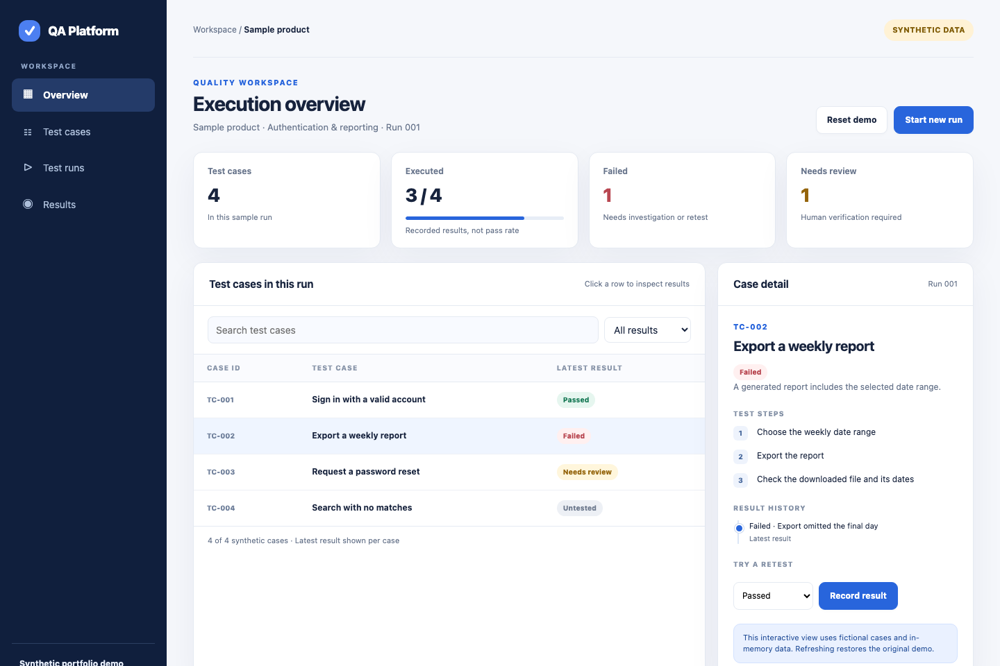

# QA Platform — Portfolio Demo

**Pornpavit Tantilavasute · QA Engineer**

A small, runnable sample from a test-management platform I created. It demonstrates how I model test execution and protect the meaning of QA results: a retest should update the current outcome without erasing history, and an untested case should never look like a pass.

This repository contains a selected execution-domain extract, a local interactive UI illustration, and synthetic examples. The image below is from the local demo, not the original application.



## Start here — two minutes

1. Open [the visual demo](visual/index.html) locally. Try a retest and watch the result history update.
2. See the [retest example screenshot](docs/images/retest-history.png) and [sample terminal run](docs/demo-output.md).
3. Open the [execution rules](src/execution.ts), [regression tests](test/execution.test.ts), and [scope notes](docs/scope.md).

## Run locally

The visual demo needs only a browser: open `visual/index.html` from a clone or the ZIP. For the TypeScript CLI and tests, use Node.js 26 or later. No package installation, credentials, database, or network access is needed after cloning.

```sh
npm run demo
npm test
```

## What this demonstrates

| QA concern | Implemented behavior |
| --- | --- |
| Run lifecycle | Only active runs accept results; cancellation is final |
| Retest history | Highest sequence wins within a run case; old rows remain intact |
| Honest progress | Missing results remain untested; only selected cases contribute |
| Repeatable selection | Case order does not change the selection identity; revisions do |
| Cross-run results | Compare latest results deterministically, including clock and timestamp ties |

The tests exercise the state matrix, empty and duplicate selections, retests, scope boundaries, and deterministic ordering. The demo labels recorded results separately from pass rate.

## My contribution

I designed the QA workflow and built the original platform with AI-assisted implementation and review. This portfolio sample isolates its execution rules so a reviewer can understand and test them without internal systems. Comments and validation messages were adapted for this English-language sample; the surrounding CLI and fixtures were written for the demo.

The visual page is a purpose-built illustration with fictional cases and in-memory results. The broader platform includes case management, plans, evidence, and integrations; the screenshot is not presented as its production UI.

## Related work

- [QA Brain demo](https://github.com/CasperBoii/qa-brain-demo) — knowledge capture and reuse
- [QA automation framework](https://github.com/CasperBoii/qa-automation-framework) — AI-readable QA skills and automation standards

Private portfolio sample. Repository access is required to open its links; it does not grant access to the original application.
